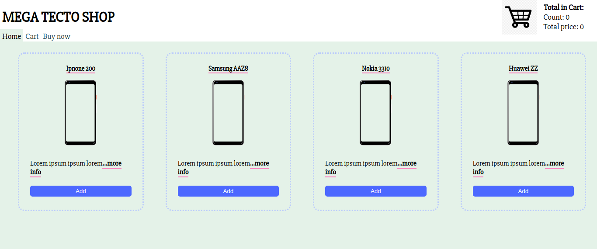
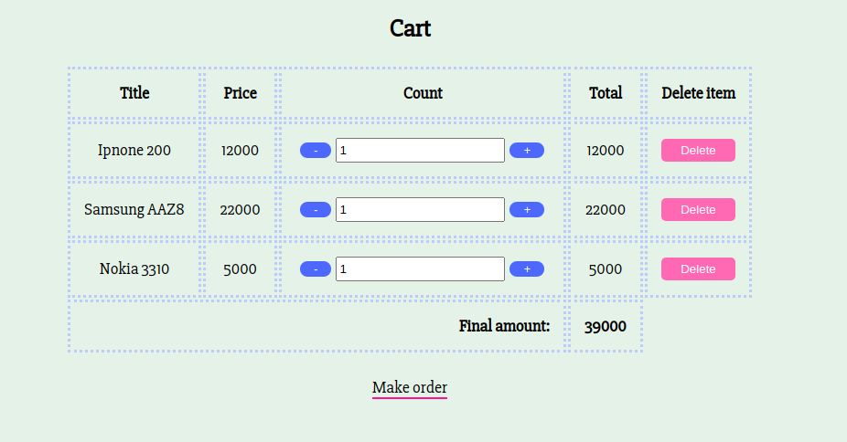
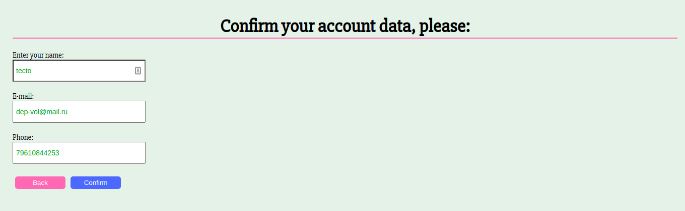
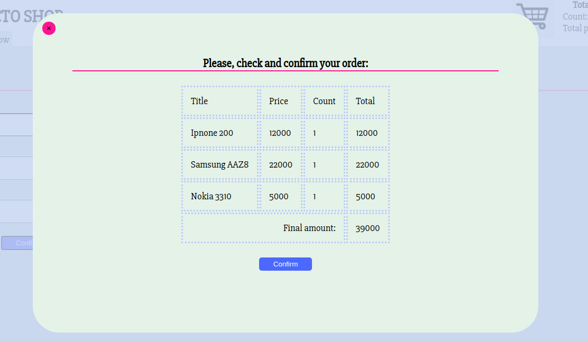
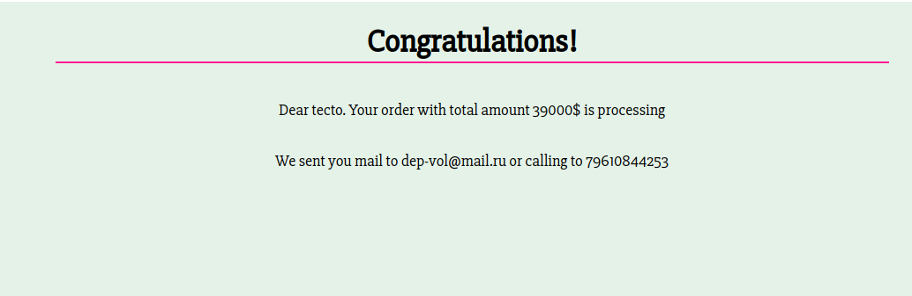

# Shop demo with MobX
- [Shop demo with MobX](#shop-demo-with-mobx)
  - [Used stack](#used-stack)
  - [Screenshots:](#screenshots)

## Used stack 
1. React class components
2. Container pattern
3. CSS modules
4. MobX
5. Class api
6. High order components
7. Routes
8. React-bootstrap
9. Prop-types
10. React.ref
11. Form validation
    
## Screenshots:

First screen

Cart screen

Confirm screen

Modal screen

Result screen

